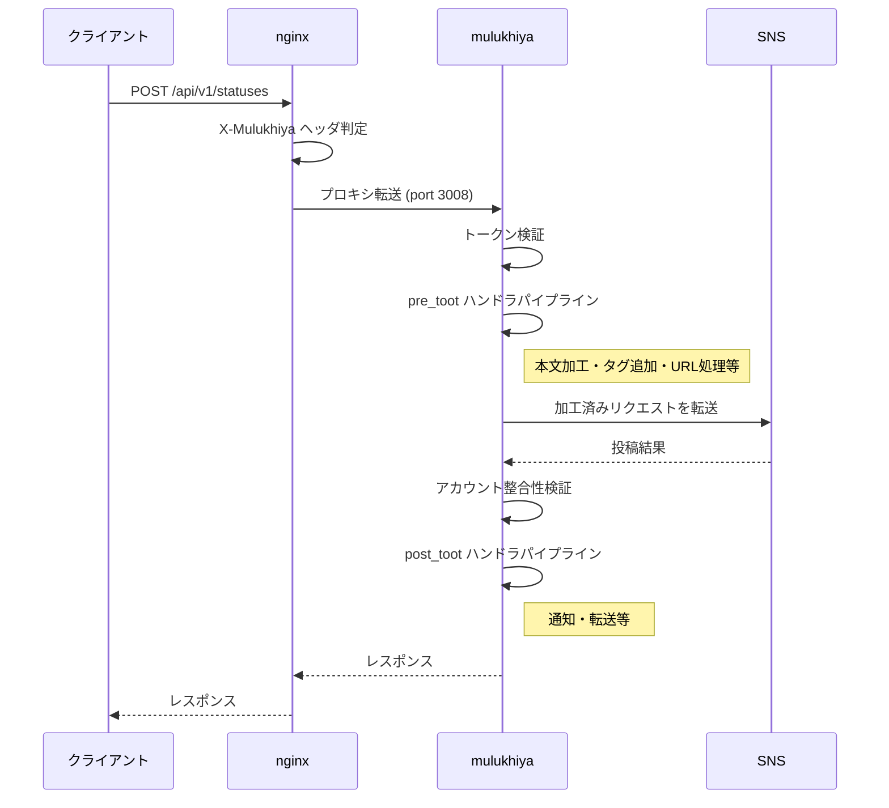

# mulukhiya-toot-proxy


各種ActivityPub対応サーバーへの投稿に対して、内容の更新等を行うプロキシ。通称「モロヘイヤ」。
詳細は[wiki](https://github.com/pooza/mulukhiya-toot-proxy/wiki)にて。

## 対応サーバー

- [Mastodon](https://github.com/tootsuite/mastodon)
- [Misskey](https://github.com/syuilo/misskey)

## ブランチ

| ブランチ | バージョン | 状態 |
| --- | --- | --- |
| `main` | 5.x | 開発中（デフォルト） |
| `v4` | 4.x | メンテナンス |

旧ブランチ名（`master` / `develop`）からリネーム済み（2026-02-22）。
既存の環境では一度だけブランチの切り替えが必要。以降は従来通り `git pull && bundle install` で更新できる。

### 4.x系を利用中の場合（旧 master）

```bash
git branch -m master v4
git fetch origin
git branch -u origin/v4 v4
```

### 5.x系に移行する場合（旧 develop）

```bash
git branch -m develop main
git fetch origin
git branch -u origin/main main
```

5.xへの移行には追加の設定変更が必要。[アップグレードガイド](docs/upgrade-guide-5.0.md)を参照。

## 導入前提

- Ruby >= 4.0.1
- PostgreSQL（SNS側のDB参照用）
- Redis 7+
- nginx（リバースプロキシ）
- libvips（画像処理）
- ffmpeg（メディア変換）

## アーキテクチャ

クライアントからの投稿リクエストをインターセプトし、ハンドラパイプラインで加工してからSNS APIに転送する。



- nginxがURLパターン（`/api/v1/statuses`, `/api/v1/media` 等）でリクエストをmulukhiyaに振り分け
- **pre_toot**: 投稿前にハンドラが本文・メディアを加工（URL正規化、NowPlaying、タグ付け等）
- **post_toot**: 投稿後にハンドラが後処理を実行（通知送信、PieFed転送等）
- `X-Mulukhiya`ヘッダによるループ防止（mulukhiyaからSNSへの転送時にnginxが直接SNSにルーティング）

## 機能の概略

投稿本文に対して、

- 各種短縮URLを戻し、本来のリンク先を明らかにする
- 日本語を含んだURLを適切にエンコードし、クリックできるようにする
- Amazonの商品URLからノイズを除去する
- ハッシュタグ `#nowplaying` を含んでいたら、曲情報やサムネイルを挿入
- サーバーのテーマと関係あるワードを含んでいたら、ハッシュタグを追加
- アニメ実況支援。実況中の番組と関連したハッシュタグを追加
- デフォルトハッシュタグを追加

アップロードされたメディアファイルについて、

- 画像ファイルを上限ピクセルまで縮小
- WebPに変換し、ファイルサイズを小さくする
- サーバーが本来受け付けないメディアファイルを変換
- メディアタイプに応じた `#image` `#video` `#audio` 等のタグを本文に挿入

その他、

- webhook（Slack Incoming Webhook下位互換）
- 新規登録者へのウェルカムメッセージ
- ハッシュタグのRSSフィード / カスタムRSSフィード
- お知らせの念押し投稿
- [Annict](https://annict.com/)からの視聴記録取得・投稿
- ブックマークされた公開投稿の[PieFed](https://join.piefed.social)転送

## セットアップ

```bash
git clone https://github.com/pooza/mulukhiya-toot-proxy.git
cd mulukhiya-toot-proxy
bundle install
cp config/sample/mastodon/local.yaml config/local.yaml  # Misskeyの場合は misskey/
vi config/local.yaml  # SNSのURL、PostgreSQL DSN等を設定
```

- nginx設定: `config/sample/{mastodon,misskey}/mulukhiya.nginx`
- サービス起動スクリプト: `config/sample/{ubuntu,rhel,freebsd}/`
- 設定の詳細: [config/sample/README.md](config/sample/README.md)

## ディレクトリ構成

```text
app/lib/mulukhiya/
  controller/     # SNS別コントローラ (Mastodon, Misskey)
  handler/        # 投稿処理ハンドラ
  service/        # SNS APIクライアント
  listener/       # WebSocket/Streamingリスナー
  model/          # SNS別モデル
  worker/         # Sidekiqワーカー
config/
  application.yaml  # メイン設定
  sample/           # サンプル設定・起動スクリプト
views/              # Slimテンプレート + Vue.js
test/               # テスト
```
